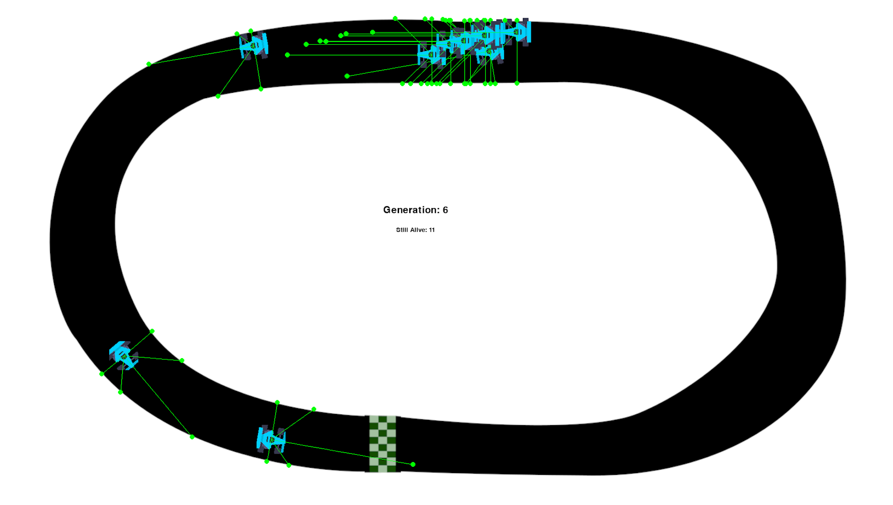

# Aldrin Brillante's Reinforcement Racer Project!

This project is an advanced-level project for students of ACS 4511: Core Applications of Artificial Intelligence, taken at Dominican University of California.

This project contains adequate tutorial code and challenges to assess student competencies in the field of deep learning, reinforcement learning, and data-centric computer science.

To successfully complete this project, please access and make use of the `CHALLENGES.md` file located at the top level of this project directory.

## SUMMARY

This project will have you construct a working neural-network-based simulation that will allow you to iteratively train a game-playing bot to train a racecar on an input track of your choice.

The catch?

The bot will be reinforcement-learning-based, meaning that you will provide _no_ hardcoded instructions as to the course's game environment.

In order to build this project, we'll be making use of two key libraries that you may not be used to:

- `pygame`
- `NEAT`

The former library (`pygame`) is a simulation-based game-playing package that allows for careful engineering and construction of games such as Chess, Snake, Tic-Tac-Toe, etc.

It comprises the skeleton of our project, so to speak.

The latter library (`NEAT`) is a scientific engineering library that combines neural network development utilities with easy timestep-driven-training configuration using a technique called _genetic algorithms_.

(The precise nature of how genetic algorithms relate to neural network development isn't terribly important at this time; however, what is important is that this library will allow us to perform timestep-driven reinforcement seamlessly.)

It comprises the heart and brain of our project, so to speak.

In order for `NEAT` to function successfully, it will make use of an additional file called `config.txt`, which sets up numerous configuration parameters that allow our neural networks to be constructed and iteratively trained as we expect.

## ACKNOWLEDGEMENTS

Thanks to **Zain Raza**, **Gobind Puniani**, and **Hani Jandali**, my fantastic team of teaching assistants, for assisting me with structuring content and curricula for this ambitious course.

Special thanks to **@NeuralNine** and **@monokim** for their starter repositories – their work allows for easy tutorialization and abstraction from project to challenge.
